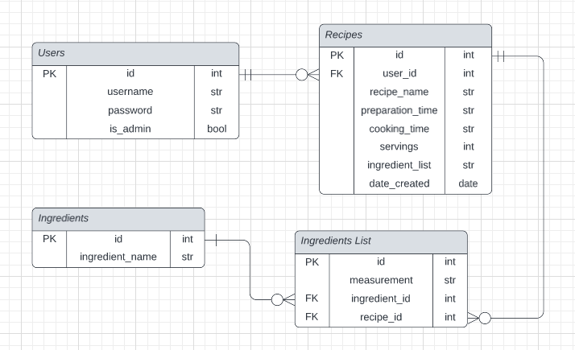

# API

## **Identification of the problem you are trying to solve by building this partiular app. And why? (R1, R2)**  
  
I like to cook. Like, I like to cook a LOT. I also really like trying new recipes. I often find myself scouring the internet for recipes, only to be astounded by the endless possibilities and lack of organisation on most recipe sites. After scouring the internet for the perfect recipe, I'll eventually give up and just select one whatever's on my screen by that point.
  
On my recipe searches, I encounter way too many recipe blogs that bombard you with a life story of minimal importance, requiring way too much scrolling to get to the actual recipe at the bottom of the page.  

These unfortunately frequent recipe-hunting experiences had me thinking about the need for some sort of social recipe sharing API, in which users could upload and share their collection of recipes. Creating an API that's focused on what actually matters (i.e. the recipe!) and presenting it right where you would want to see it (i.e. the top of the page!) seems like a thing the world of online recipes needs.

-----

## **Why have I chosen this database system? What are the drawbacks compared to others? (R3)**

For this app, I have chosen to use PostgresSQL. PostgresSQL belongs to the category of Relational Database Management System's (RDBMS). RDBMS involve the use of the Structured Database Query Language (SQL). SQL allows a database system to access and manipulate the databases within. Notably, information redundancy and real-time flexibility are distinct perks of using a RDBMS over a non-relational DBMS. Information can be easily normalized, and when dealing with bigger databases RDBMS's can maintain better data consistency.

Why PostgresSQL though? PostgresSQL is open-source software, meaning that anyone can use it for whatever their intended purpose is. PostgresSQL has a large community of dedicated developers behind it, along with an extensive history and strong reputation for its architecture, data integrity and extensibility. As a student, being able to access such a powerful RDBMS for free is highly appreciated.  

Whilst not many, there are a few drawbacks to PostgresSQL. PostgresSQL has been found to be slower than another RDBMS, MySQL. MySQL also has a larger library of supported open-source apps than PostgresSQL. However, for my app neither of these drawbacks were considered to be much of a problem.

---

## **Identify and discuss the key functionalities and benefits of an ORM (R4)**

An ORM (Object-Relational-Mapper) allows you to interact with relational databases in the language of your choice. Whilst SQL is considered an incredibly powerful language, an ORM can let you develop your own queries in a language you are more comfortable in. This can increase the speed in which an application can be developed. Furthermore, ORM's can allow you to switch RDBMS's easily (if neccessary).

An ORM has a collection of built-in queries that can be used on a database (within the chosen ORM language), further saving time for the developer. Removing the necessity for constant switching between languages can lead to quicker production times.

---

## **Document all endpoints for the API (R5)**

### /users/
- Methods:
- Arguments:
- Description:
- Authentication:
- Authorization:
- Request Body:
- Response Body:

---

## **ERD(R6)**

---

## **Detail any thrid-party/packages the app uses (R7)**

ss

---

## **Describe your projects models in terms of the relationships they have with each other (R8)**

ss

---

## **Discuss the database relations to be implemented in your application (R9)**

ss

---

## **Describe the way tasks are allocated and tracked in your project(R10)**

ss

---
