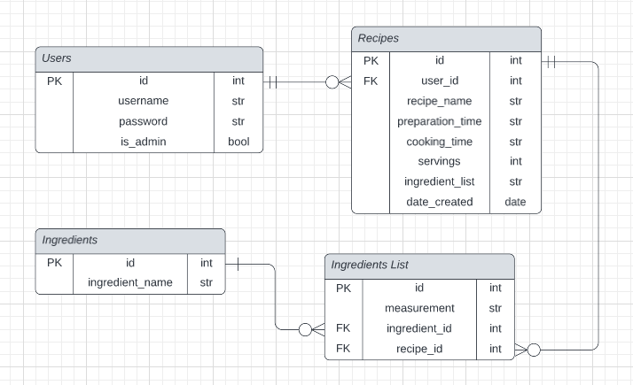

# API

## **Identification of the problem you are trying to solve by building this partiular app. And why? (R1, R2)**  
  
I like to cook. Like, I like to cook a LOT. I also really like trying new recipes. I often find myself scouring the internet for recipes, only to be astounded by the endless possibilities and lack of organisation on most recipe sites. After scouring the internet for the perfect recipe, I'll eventually give up and just select one whatever's on my screen by that point.
  
On my recipe searches, I encounter way too many recipe blogs that bombard you with a life story of minimal importance, requiring way too much scrolling to get to the actual recipe at the bottom of the page.  

These unfortunately frequent recipe-hunting experiences had me thinking about the need for some sort of social recipe sharing API, in which users could upload and share their collection of recipes. Creating an API that's focused on what actually matters (i.e. the recipe!) and presenting it right where you would want to see it (i.e. the top of the page!) seems like a thing the world of online recipes needs.

-----

## **Why have I chosen this database system? What are the drawbacks compared to others? (R3)**

For this app, I have chosen to use PostgresSQL. PostgresSQL belongs to the category of Relational Database Management System's (RDBMS). RDBMS involve the use of the Structured Database Query Language (SQL). SQL allows a database system to access and manipulate the databases within. Notably, information redundancy and real-time flexibility are distinct perks of using a RDBMS over a non-relational DBMS. Information can be easily normalized, and when dealing with bigger databases RDBMS's can maintain better data consistency.

Why PostgresSQL though? PostgresSQL is open-source software, meaning that anyone can use it for whatever their intended purpose is. PostgresSQL has a large community of dedicated developers behind it, along with an extensive history and strong reputation for its architecture, data integrity and extensibility. As a student, being able to access such a powerful RDBMS for free is highly appreciated.  

Whilst not many, there are a few drawbacks to PostgresSQL. PostgresSQL has been found to be slower than another RDBMS, MySQL. MySQL also has a larger library of supported open-source apps than PostgresSQL. However, for my app neither of these drawbacks were considered to be much of a problem.

---

## **Identify and discuss the key functionalities and benefits of an ORM (R4)**

An ORM (Object-Relational-Mapper) allows you to interact with relational databases in the language of your choice. Whilst SQL is considered an incredibly powerful language, an ORM can let you develop your own queries in a language you are more comfortable in. This can increase the speed in which an application can be developed. Furthermore, ORM's can allow you to switch RDBMS's easily (if neccessary).

An ORM has a collection of built-in queries that can be used on a database (within the chosen ORM language), further saving time for the developer. Removing the necessity for constant switching between languages can lead to quicker production times.

ORM's generate objects which map to tables in the selected database. Once these connections have been made the ORM acts as an abstraction layer for the application towards the database, allowing the developer to code away in the preferred language, which can then be reflected in the database.

---

## **Document all endpoints for the API (R5)**

### /users/
- Methods:
- Arguments:
- Description:
- Authentication:
- Authorization:
- Request Body:
- Response Body:

---

## **ERD(R6)**

---

## **Detail any thrid-party services/packages the app uses (R7)**

The third-party services/packages used in my app are:

- Flask
  - Python web framework, provides tools and libraries to assist with building a web framework.
- SQLAlchemy
  - A Python SQL toolkit and ORM. Generates SQL statements to interact with the RDBMS.
- psycopg2
  - A PostgresSQL database adapter for Python. Allows generated SQL statements from SQLAlchemy to be sent to the database.
- Marshmallow
  - A Python library that converts complex data types to native Python data types and vice versa.
- Bcrypt
  - A password-hashing function, used to secure passwords.
- JWT
  - imported via flask-jwt-extended. JWT (JSON Web Tokens) allow user to be authorised and identified by the server.
- DateTime
  - Used to generate the current date when requested.

---

## **Describe your projects models in terms of the relationships they have with each other (R8)**

### Users

- The users model has id, username, first_name, password, is_admin and recipes columns.
- The recipes column has a relationship with users, and thus, when a user is queried any recipes that they have contributed will be displayed. If a user was to be deleted any recipes that they have contributed will be deleted as well.

### Recipes

- The recipes model has id, recipe_name, preparation_time, cooking_time, servings, process, date_created, user_id and ingredient_lists columns.
- The user_id column is a foreign key from associated with the id from the users table.
- The ingredient_lists column references a relationship with the ingredient_lists table. When a recipe is queried, the related entries in the ingredient_lists table will be displayed too. If a recipe was to be deleted it would also delete any associated data in the ingredient_lists table.

### Ingredients

- The ingredients model has id, name, and ingredient_lists columns.
- The ingredients_list column is a relationship with the ingredients table. 

### Ingredient Lists

- The ingredient_lists model has id, measurement, ingredient_id, and recipe_id columns.
- The ingredient_id column is a foreign key from associated with the id from the ingredients.
- The recipe_id column is a foreign key from associated with the recipe.

---

## **Discuss the database relations to be implemented in your application (R9)**

The first relationship is between the users table and the recipes table. The users table has a one-to-many relationship with the recipes table. This means that a user can have many recipes, but a recipe can only have one user. The user_id is a foreign key value in the recipes table. Users are also not required to contribute a recipe, so there may not necessarily be a corresponding recipe value for each user.

The second relationship is between the recipes table the ingredient_lists table. The recipes table has a one-to-many relationship with the ingredient_lists table. This means that recipe can have many ingredient_lists values associated with it, but a value in the ingredient_lists table will only direct to one recipe.

The third relationship is between the ingredients table and the ingredient_lists table. The ingredients table has a one-to-many relationship with the ingredient_lists table. This means that an ingredient can have many ingredient_lists values associated with it, however, an entry in the ingredient_lists table will only direct to one ingredient.

The last two relationships were both one-to-many (with both directing to the ingredients_list table), however this designed in order to satisfy a many-to-many relationship that exists between recipes and ingredients. As you cannot have a direct relationship with a many-to-many relationship, it is necessary to have a join table. The join table has two forieng keys from each of the other two tables, allowing for the ingredient to direct to recipes and vice versa.

---

## **Describe the way tasks are allocated and tracked in your project(R10)**

ss

---
